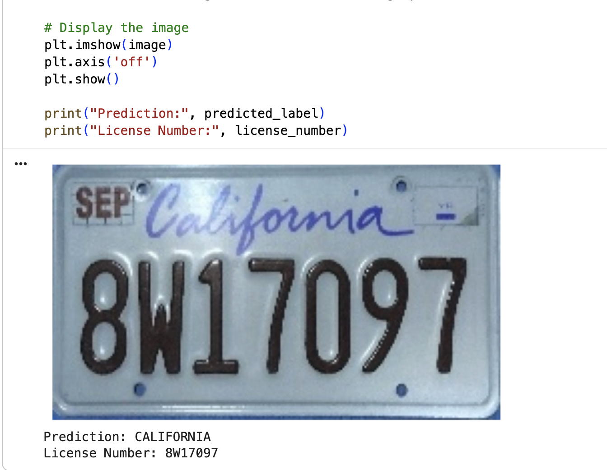

# License-Plate-Recognition-Using-Deep-Learning
A deep learning-based license plate recognition system for accurate state and vehicle registration number prediction from license plate images.

# Overview
This project implements a deep learning-based license plate recognition system for accurate state and vehicle registration number prediction from license plate images. The system uses Convolutional Neural Networks (CNNs) and Optical Character Recognition (OCR) to classify license plate images and extract text information.

The solution supports applications such as traffic management, automated parking systems, security monitoring, and vehicle tracking.

# Objectives
- Develop an automated license plate recognition system.
- Predict license plate state classification.
- Extract registration numbers from images.
- Improve image recognition accuracy using deep learning models.
- Demonstrate real-world AI applications in smart systems

# Data Description
The dataset obtained from Kaggle contains license plate images from 50 US states, the District of Columbia, and 5 US territories. Images are high-quality, cropped, and cleaned to remove duplicates. Image size is 128 × 224 × 3.

- **Data source** [kaggle](https://www.kaggle.com/datasets/gpiosenka/us-license-plates-image-classification/data)

### Model Used
VGG16 - RestNet (Best Performing Model) - EasyOCR

### Technologies Used
Python - PyTorch - Flask - Fastdup - HTML

## Training and Optimisation
Adam optimizer - SGD optimizer - Learning rate adjustment - Weight decay regularisation

### Model Performance
Accuracy: 92.14% - Precision: 92.40% - Recall: 92.14% - F1 Score: 91.67%

# Conclusion
The model successfully predicts license plate state and registration numbers with high classification accuracy on unseen test data, demonstrating reliable performance and strong potential for real-world applications.

## Result snippet
   <image src="Images/Screenshot_2.png" width=250>

  *Request access for [.ipynb](https://colab.research.google.com/drive/1WaFL_XSHzbuvNBYW8wtXDp5xI0uvJSdB?usp=sharing)*
